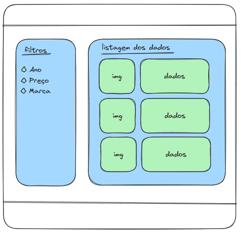
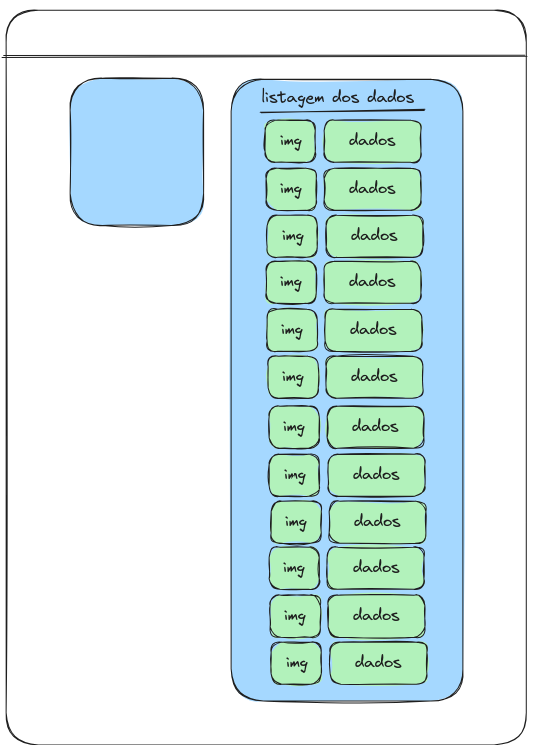

# Projeto 1 (READ) CRUD

### Você deve priorizar o Javascript.

1. Criar uma base de dados, com ao menos 12 carros.
2. Estar atento com a base de dados, pois elas devem servir para serem usadas pelos filtros.
3. Inicialmente, a página deve exibir todos os carros.

Layout Final:

Layout Inicial:

ETAPA 3 para criar todos os carros:

Você deve localizar no html, a div com o id="lista-carros";

Depois dentro do script, criar uma variavel e usar o método document.getElementById() para resgatar essa div.
